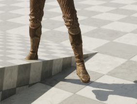
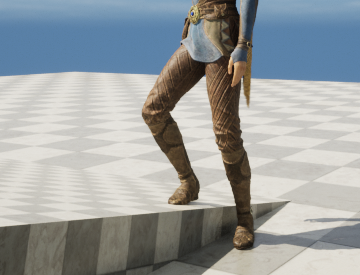
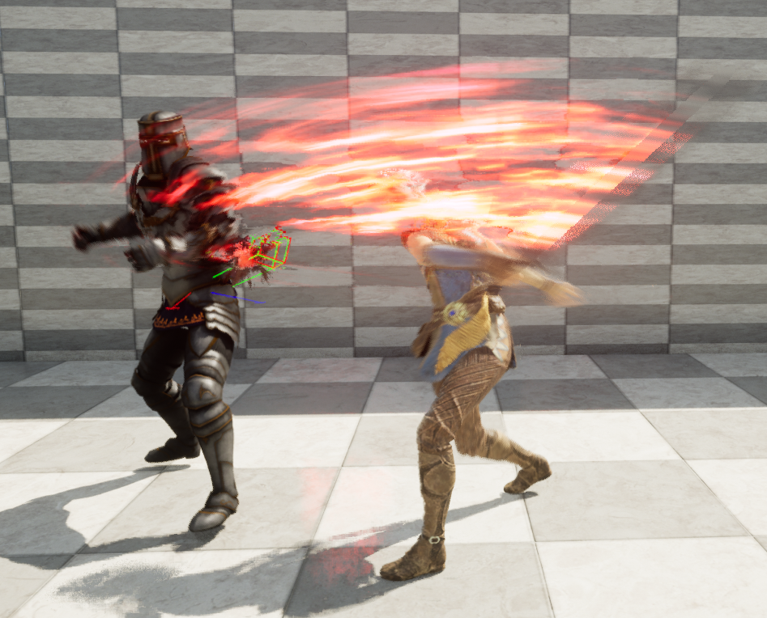

# Slash2
Unreal Engine5を用いて製作中のオープンワールドアクションゲーム

## マップ 
Unreal Engine5のオープンワールドツールを使用してマップを制作

## プレイヤーの機能　(SlashCaharacter.cpp)
歩行，走行，ジャンプ，攻撃

段差に合わせて足を曲げるように調整

  <table>
    <tr>
      <td></td>
      <td></td>
    </tr>
  </table>

武器が敵との衝突地点を検出(BoxTrace)

攻撃方向に応じてリアクションをとるように

## 敵の機能 (Enemy.cpp)

- ここにこのプロジェクトの主な機能をリストアップします。

## 参考文献 (References)
https://www.udemy.com/course/unreal-engine-5-the-ultimate-game-developer-course/

